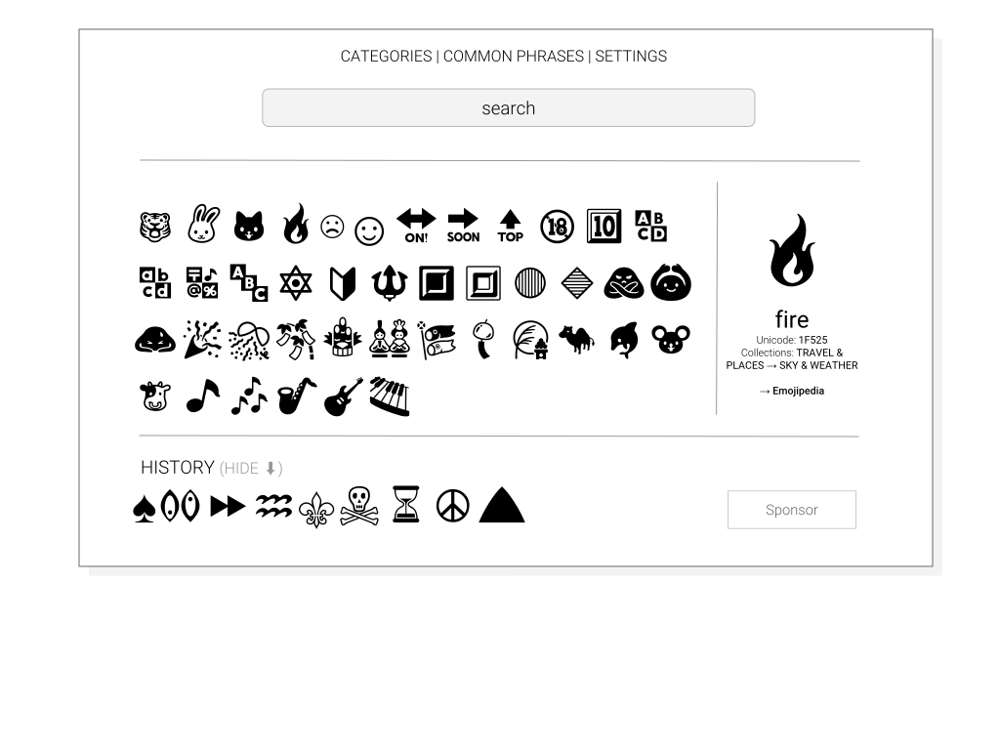

 ✋ lazy emoji copy/paste → [pax.github.io/emojibro](https://pax.github.io/emojibro/)
   _Where I learn how to set-up a simple [PWA](https://notes.pinboard.in/u:pax/notes/81ded6e4a4013ca0ab4c)_

Gennerating data
---

app/

- node: generator/`fetch-unicode.org.js` + [unicode.org/emoji](https://unicode.org/emoji/charts/full-emoji-list.html) → data/**`emojis.csv`**
- generator/`google-sheets.php` +  google Sheets → data/**`emoji.json`**
- generator/`generator.php` → **`index.html`**

Uses [lgarron/clipboard-polyfill](https://github.com/lgarron/clipboard-polyfill) for copying to cliboard, [matthewmueller/x-ray](https://github.com/matthewmueller/x-ray/) for fething emoji list.

Google Sheets cols
---

- char
- unicode
- no
- name
- ctg
- subctg
- keywords: (manually edited)
- opts: *hide | show | fav | xappl | xwin* (manually edited). 
     xwin, xappl – missing on windows, apple

[Roadmap](https://github.com/pax/emojibro/projects/2)

v2.0

v1.0 screenshots: [desktop](assets/screenshot-desktop.png), [mobile](assets/screenshot-mobile.png)

### Alternatives / See also
- [Full Emoji List](https://unicode.org/emoji/charts/full-emoji-list.html) (v11.0)
- [EmojiKeyboard](https://emojikeyboard.io/)
- [Emoji Tyoer](https://emojityper.com/)
- [EmojiCopy](https://www.emojicopy.com/)
- [Emojipedia](https://emojipedia.org/)
- [Emojisaurus](https://emojisaurus.com/)
- [oliveratgithub/emojis.json](https://gist.github.com/oliveratgithub/0bf11a9aff0d6da7b46f1490f86a71eb)
- [decodemoji](http://decodemoji.com/)
- [Alternative products to Emoji Translate](https://www.producthunt.com/alternatives/emoji-translate)
- [WhatMoji](http://whatmoji.com/)

