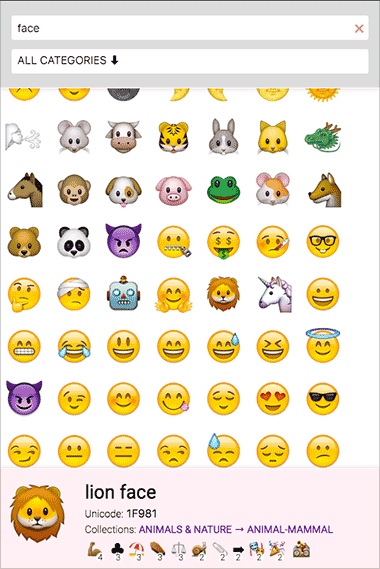

 ✋ lazy emoji copy/paste → [github.io/emojibro](https://pax.github.io/emojibro/)

_Where I learn how to set-up a simple [PWA](https://en.wikipedia.org/wiki/Progressive_Web_Apps)_

 #### Roadmap &amp; bugs [aka TO DO]

- ~~record history to localStorage~~
- ~~replace copy function, ditch input select?~~
- ~~refresh history on copy element~~
- ~~activity: show only last 20 most used~~ and the last used
- ~~when searching reser select to 'all'~~
- make bookmarks interactive
- size in history based on usage
- dispay last copied charcter on load 
- display random character on load
- delete favorites: all / element
- PWA – figure out service workers
- analytics? log interaction → most popular (list)
- search emoji
    + ~~search in titles~~
    + ~~search in categories~~
    + add keyword field to emoji list
- fix list
    + remove duplicates – add parent emoji? to
    + group color versions of same emoji
    + create UNICODE version
- add settings
    + default color
- add common phrases
- ~~optimize for mobile - search and categories menus hidden~~ 
- move to `emojibro.github.io`

### Alternatives / See also
- [Full Emoji List](https://unicode.org/emoji/charts/full-emoji-list.html) (v11.0)
- [EmojiKeyboard](https://emojikeyboard.io/)
- [EmojiCopy](https://www.emojicopy.com/)
- [Emojipedia](https://emojipedia.org/)
- [Emojisaurus](https://emojisaurus.com/)
- [oliveratgithub/emojis.json](https://gist.github.com/oliveratgithub/0bf11a9aff0d6da7b46f1490f86a71eb)
- [decodemoji](http://decodemoji.com/)
- [Alternative products to Emoji Translate](https://www.producthunt.com/alternatives/emoji-translate)
- [WhatMoji](http://whatmoji.com/)
